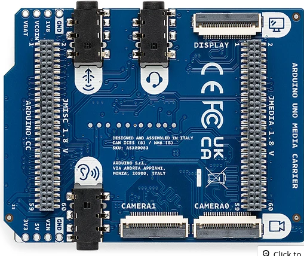
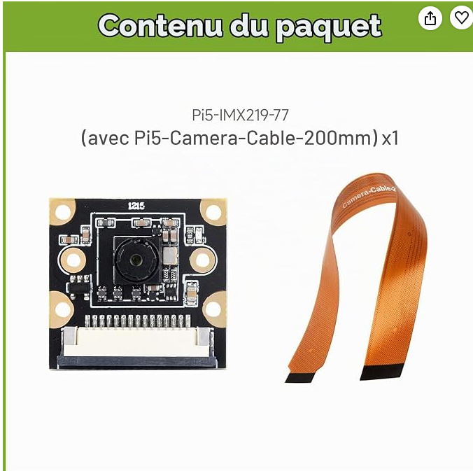

# IMX219 Camera with Arduino App Lab

## Project overview

This project demonstrates how to use a Sony IMX219 camera with an Arduino UNO Q, the Arduino® UNO™ Media Carrier, and Arduino App Lab.

The application provides a simple WebUI that allows the user to:

- adjust the camera exposure;
- adjust the analogue gain;
- capture a full-resolution image (3280 × 2464);
- process the RAW Bayer image;
- display the resulting JPEG image directly in the WebUI.

The project does not use the MCU. The complete application runs on the Linux/MPU side.

Although the application itself is relatively simple to use, several different components work together behind the scenes: the WebUI, the main Python application, an App Lab camera brick, a local HTTP service, Linux V4L2 tools, and the IMX219 camera connected through the Media Carrier.

One of the goals of this README is therefore not only to explain how to run the application, but also to describe this architecture in simple terms for users who are discovering Arduino App Lab.

## How the application works

Before looking at the source code, it is useful to understand the basic path followed by a command:

    Web browser
        │
        ▼
    WebUI (app.js)
        │
        ▼
    Main application (main.py)
        │
        ▼
    Camera interface (__init__.py)
        │
        ▼
    Camera service (camera_service.py)
        │
        ▼
    Linux camera interface (V4L2 / Media Controller)
        │
        ▼
    Media Carrier
        │
        ▼
    Sony IMX219 camera

Each part has a specific role.

The WebUI interacts with the user.  
`main.py` manages the application logic.  
`__init__.py` provides a simple Python interface to the camera service.  
`camera_service.py` controls the Linux camera pipeline and performs the image acquisition and processing.  
The Media Carrier provides the hardware interface used to connect the IMX219 camera to the board.

The following sections explain these different layers step by step.

## Tested environment

This project was developed and tested with the following environment:

```text
Board:            Arduino UNO Q — 4 GB version
Operating system: Debian Linux
Arduino App Lab:  0.10.0
Python:           3.13
Camera:           Sony IMX219
Camera interface: Arduino® UNO™ Media Carrier — CAMERA0
```

The camera service also uses:

```text
v4l-utils
NumPy
Pillow
```

These dependencies are installed automatically inside the dedicated camera container.

Their exact versions are not fixed by this project and may depend on the container image and package repositories available when the container is built.

## Hardware and software requirements

### Hardware

This project uses:

- an Arduino UNO Q;
- an Arduino® UNO™ Media Carrier;
- a Sony IMX219 camera module;
- the appropriate camera ribbon cable.

The IMX219 camera is connected to one of the MIPI-CSI camera connectors
of the Arduino® UNO™ Media Carrier.

#### Arduino® UNO™ Media Carrier

The Arduino® UNO™ Media Carrier provides the hardware interface used
to connect the IMX219 camera to the UNO Q.



#### Camera used for this project

The camera used during development is a Sony IMX219-based camera module
supplied with its camera ribbon cable.

[Camera used for this project (Amazon France)](https://www.amazon.fr/dp/B0CPM292WP)



### Software

The application is developed and executed with Arduino App Lab.

No manual installation of the camera processing dependencies is required
on the Linux system. The additional packages needed by the camera service
are installed automatically inside its dedicated container.

These dependencies will be described later when we look at the camera brick.

## Understanding the two containers

When the application starts, App Lab runs two containers.

Their exact names depend on the name of the application, but they can be
identified by their final part:

- `main-1`
- `camera-1`

For this project, they have two clearly separated roles.

### The main container

The `main-1` container runs the main App Lab application.

It is responsible for:

- executing `python/main.py`;
- providing the App Lab runtime used by the application;
- managing the WebUI brick;
- making the files in `assets/` available to the WebUI.

The WebUI does not run in a separate third container.

The HTML, CSS and JavaScript files define the interface displayed in the
web browser, while `main.py` contains the main Python logic of the application.

In simple terms:

    Web browser
         │
         │ WebUI
         ▼
    ┌──────────────────────────────┐
    │ main-1 container             │
    │                              │
    │ python/main.py               │
    │ WebUI                        │
    │ assets/                      │
    │   index.html                 │
    │   app.js                     │
    │   style.css                  │
    └──────────────────────────────┘

### The camera container

The `camera-1` container is created by the custom `camera` brick.

Its main purpose is to isolate everything that is specific to the camera.

It runs `camera_service.py`, which:

- receives requests from the main application;
- configures the Linux camera pipeline;
- controls the IMX219 sensor;
- captures the RAW image;
- processes the image;
- returns the resulting JPEG image to the main application.

The additional Linux and Python dependencies required for these operations
are installed automatically inside this container.

In simple terms:

    ┌──────────────────────────────┐
    │ main-1 container             │
    │                              │
    │ main.py                      │
    └──────────────┬───────────────┘
                   │
                   │ local HTTP communication
                   ▼
    ┌──────────────────────────────┐
    │ camera-1 container           │
    │                              │
    │ camera_service.py            │
    │ V4L2 / Media Controller      │
    │ NumPy / Pillow               │
    └──────────────┬───────────────┘
                   │
                   ▼
                 IMX219

## Communication between the WebUI and `main.py`

The WebUI displayed in the browser and the Python application need to exchange information.

The WebUI brick makes this communication simple by providing two main functions:

- `send_message(name, data)` sends a message identified by `name`, with `data` as its content;
- `on_message(name, function)` listens for messages identified by `name` and calls `function` when such a message is received.

These two functions can be used in both directions.

This means that `app.js` can send a message to `main.py`, but `main.py` can also send a message back to `app.js`.

In simple terms:

```text
Browser / app.js                         Python / main.py

send_message("A", data)  ───────────►  on_message("A", function)

on_message("B", function) ◄───────────  send_message("B", data)
```

### Example: changing the camera settings

When the user clicks the button to apply the camera settings, `app.js` sends a message:

```javascript
ui.send_message("regler_camera", {
    exposure: Number(exposure.value),
    analogue_gain: Number(gain.value)
});
```

In `main.py`, the application listens for this message:

```python
ui.on_message("regler_camera", regler_camera)
```

When the message arrives, the function `regler_camera()` is called and receives the data sent by the WebUI.

After processing the request, `main.py` can send a message back to the WebUI:

```python
ui.send_message("camera_settings_update", result)
```

And `app.js` listens for this response:

```javascript
ui.on_message("camera_settings_update", (data) => {
    // Update the WebUI
});
```

The complete exchange can therefore be represented as:

```text
app.js                                      main.py
  │                                            │
  │  "regler_camera"                           │
  │  exposure + analogue_gain                  │
  ├──────────────────────────────────────────► │
  │                                            │
  │                                    regler_camera()
  │                                            │
  │  "camera_settings_update"                  │
  │ ◄──────────────────────────────────────────┤
  │                                            │
```

### Messages used by this application

The same mechanism is used for all communication between the WebUI and `main.py`:

```text
app.js  ── "get_camera_defaults" ──────────►  main.py
app.js  ◄─ "camera_defaults" ───────────────  main.py

app.js  ── "regler_camera" ────────────────►  main.py
app.js  ◄─ "camera_settings_update" ───────── main.py

app.js  ── "prendre_photo" ─────────────────► main.py
app.js  ◄─ "photo_update" ─────────────────── main.py
```

The message name acts like a label: it tells the receiving side what kind of information has arrived.

The `data` object contains the information associated with that message.

Thanks to the WebUI brick, the application does not need to implement the low-level communication between JavaScript in the browser and Python in the main container. The application can simply send and receive named messages.

## Communication between `main.py` and the camera container

We have seen how the WebUI communicates with `main.py`.

The next step is to understand how `main.py`, running in the `main-1` container, communicates with the camera service running in the separate `camera-1` container.

The file:

```text
bricks/camera/__init__.py
```

provides the link between these two parts of the application.

### The `Camera` class

`__init__.py` defines a Python class named `Camera`.

This class gives `main.py` a simple way to request camera operations without having to know how the camera hardware is controlled.

For example, `main.py` can simply call:

```python
camera.set_controls(exposure, analogue_gain)
```

or:

```python
camera.capture()
```

At this level, `main.py` does not need to know about V4L2 commands, Linux video devices, RAW image acquisition, or image processing.

The `Camera` class takes care of sending the request to the camera service.

In simple terms:

```text
main.py
   │
   │  camera.set_controls(...)
   │  camera.capture()
   ▼
Camera class
bricks/camera/__init__.py
   │
   │  HTTP request
   ▼
camera_service.py
camera-1 container
```

### A small local HTTP server

`camera_service.py` runs a small HTTP server inside the `camera-1` container.

This is not a remote Internet server.

It is a local service used only to allow the main application to communicate with the camera container.

The service listens on port `9000` and provides simple endpoints for the operations required by the application:

```text
/health
/set_controls
/capture
```

The `Camera` class converts Python method calls into requests to these endpoints.

For example:

```text
main.py
    │
    │ camera.set_controls(...)
    ▼
Camera.set_controls()
    │
    │ HTTP request to camera:9000/set_controls
    ▼
camera_service.py
    │
    ▼
Camera hardware
```

The name `camera` in `camera:9000` refers to the camera service defined by the camera brick. It allows the main container to reach the camera container without needing to know its IP address.

### Separation of responsibilities

This architecture keeps each part of the application simple.

```text
main.py
    decides what the application wants to do

        │
        ▼

__init__.py / Camera class
    knows how to contact the camera service

        │
        ▼

camera_service.py
    knows how to perform the requested camera operation

        │
        ▼

Linux camera tools
    communicate with the camera hardware

        │
        ▼

IMX219
```

This separation is useful because `main.py` remains easy to read and does not contain the low-level code required to control the camera.

The camera-specific implementation is kept inside the camera brick.

## How `camera_service.py` controls the camera

The `camera-1` container runs:

```text
bricks/camera/camera_service.py
```

This service is the part of the application that communicates with the Linux camera system.

It receives simple HTTP requests from the `Camera` class and translates them into camera operations.

### The three HTTP endpoints

The service provides three endpoints:

```text
/health
/set_controls
/capture
```

Each endpoint has a specific role.

#### `/health`

The `/health` endpoint allows the main application to check whether the camera service is running and ready to receive requests.

This is used by `main.py` before trying to communicate with the camera service.

#### `/set_controls`

The `/set_controls` endpoint receives the requested exposure and analogue gain values.

For example:

```text
/set_controls?exposure=2200&analogue_gain=98
```

The service checks the values and then applies them to the IMX219 sensor.

The supported ranges used by this project are:

```text
Exposure:       4 to 3522
Analogue gain:  0 to 232
```

Values outside these ranges are limited to the nearest valid value before being sent to the camera.

#### `/capture`

The `/capture` endpoint starts the complete image acquisition process.

The service:

1. configures the camera pipeline;
2. captures one full-resolution RAW frame;
3. converts the RAW Bayer data into an RGB image;
4. applies the image processing;
5. saves the result as a JPEG image;
6. encodes the JPEG image in Base64;
7. returns it to the main application.

The image processing itself will be explained in the next section.

### Accessing the camera through Linux

The IMX219 is not controlled directly by `main.py`.

Inside the `camera-1` container, `camera_service.py` uses standard Linux camera tools:

```text
media-ctl
v4l2-ctl
```

These tools are provided by the `v4l-utils` package.

`media-ctl` is used to configure the media pipeline between the IMX219 sensor and the video capture interface.

`v4l2-ctl` is used to configure the sensor controls and capture the RAW frame.

The camera service has access to the required Linux devices, including:

```text
/dev/media0
/dev/video0
/dev/v4l-subdev*
```

These devices are made available to the `camera-1` container by the camera brick configuration.

In simple terms:

```text
camera_service.py
       │
       ├── media-ctl
       │      │
       │      └── configures the camera pipeline
       │
       └── v4l2-ctl
              │
              ├── controls exposure and analogue gain
              │
              └── captures the RAW image
                       │
                       ▼
                     IMX219
```

### Dependencies of the camera container

The camera container requires some additional software that is not needed by the main application:

```text
v4l-utils
NumPy
Pillow
```

These dependencies are installed automatically inside the `camera-1` container by:

```text
bricks/camera/brick_compose.yaml
```

The user does not need to install them manually on the UNO Q Linux system.

This is one of the advantages of using a dedicated container: the camera-specific tools and Python libraries remain isolated from the main application environment.

## From RAW Bayer data to JPEG

When the IMX219 captures an image, it does not directly produce the final color JPEG displayed in the WebUI.

The application first captures a full-resolution RAW frame:

```text
3280 × 2464 pixels
```

This RAW frame contains the values measured directly from the camera sensor.

### The Bayer RGGB pattern

The IMX219 uses a Bayer color filter pattern.

In this project, the captured RAW data uses an RGGB arrangement:

```text
R G R G R G ...
G B G B G B ...
R G R G R G ...
G B G B G B ...
...
```

Each sensor position therefore measures only one color component:

```text
R = Red
G = Green
B = Blue
```

A RAW pixel does not yet contain complete Red, Green and Blue values.

This is why the RAW frame cannot simply be displayed as a normal color photograph.

### Demosaicing

The first processing step is called demosaicing.

The application reconstructs the missing color components for each pixel by using the values of neighboring pixels.

In simple terms:

```text
RAW Bayer data
      │
      │ demosaicing
      ▼
RGB image
```

The demosaicing is performed directly in `camera_service.py` using NumPy.

The project uses a simple bilinear interpolation method. Its purpose is not to reproduce the complete image processing pipeline of a modern digital camera, but to obtain a usable RGB image directly from the RAW IMX219 data.

### Automatic white balance

After demosaicing, the RGB image requires color correction.

The application uses a simple automatic white balance method known as Gray World.

It calculates the average level of the Red, Green and Blue channels and applies correction coefficients to bring their average levels closer together.

In simple terms:

```text
RGB image
    │
    │ Gray World white balance
    ▼
More balanced colors
```

This correction is calculated independently for every captured image.

### Shadow correction

After white balance, a custom correction curve is applied to the image.

Its purpose is to brighten dark areas while:

- preserving absolute black;
- progressively reducing the correction in brighter areas;
- protecting the highlights from unnecessary modification.

This provides more visible detail in the shadows without applying the same brightness increase to the complete image.

### Contrast and sharpness

Two final adjustments are then applied with Pillow:

- a small contrast enhancement;
- an Unsharp Mask to improve perceived sharpness.

These adjustments are deliberately moderate in order to keep the resulting image natural.

### JPEG creation

After all processing steps are complete, the RGB image is saved as a JPEG with a quality setting of `92`.

The complete image processing pipeline can therefore be summarized as:

```text
IMX219 sensor
      │
      ▼
RAW Bayer RGGB
3280 × 2464
      │
      ▼
Bilinear demosaicing
      │
      ▼
RGB image
      │
      ▼
Gray World white balance
      │
      ▼
Shadow correction
      │
      ▼
Contrast enhancement
      │
      ▼
Unsharp Mask
      │
      ▼
JPEG
quality = 92
```

### Sending the image to the WebUI

The JPEG file still has to travel from the `camera-1` container to the WebUI.

`camera_service.py` first encodes the JPEG file as Base64 text.

The image then follows the reverse path through the application:

```text
camera_service.py
      │
      │ Base64 JPEG
      ▼
Camera class
      │
      ▼
main.py
      │
      │ "photo_update"
      ▼
app.js
      │
      ▼
Web browser
```

`app.js` receives the Base64 data and uses it as the source of the image displayed in the WebUI.

The complete process, from the sensor to the browser, is therefore handled by the application without requiring the user to manually manipulate the RAW or JPEG files.

## Repository structure

Now that the different parts of the application have been introduced, the repository structure becomes easier to understand.

```text
.
├── assets/
│   ├── libs/
│   │   ├── arduino.js
│   │   └── socket.io.min.js
│   ├── app.js
│   ├── index.html
│   └── style.css
│
├── bricks/
│   └── camera/
│       ├── __init__.py
│       ├── brick_compose.yaml
│       ├── brick_config.yaml
│       └── camera_service.py
│
├── images/
│   ├── imx219-camera.png
│   └── uno-media-carrier.png
│
├── python/
│   └── main.py
│
├── .gitignore
├── app.yaml
└── README.md
```

Each directory has a specific purpose.

### `assets/`

The `assets/` directory contains the WebUI.

```text
assets/
├── libs/
│   ├── arduino.js
│   └── socket.io.min.js
├── app.js
├── index.html
└── style.css
```

- `index.html` defines the structure of the user interface.
- `style.css` defines its appearance.
- `app.js` manages the user interactions and exchanges messages with `main.py`.
- `libs/arduino.js` provides the App Lab WebUI JavaScript interface used by the application.
- `libs/socket.io.min.js` provides the underlying Socket.IO communication support used by the WebUI.

### `python/`

The `python/` directory contains the main Python application:

```text
python/
└── main.py
```

`main.py` is the central application logic.

It receives messages from the WebUI, requests operations from the camera brick, and sends the results back to the WebUI.

It also defines the initial exposure and analogue gain values used when the application starts.

### `bricks/camera/`

This directory contains the custom camera brick:

```text
bricks/camera/
├── __init__.py
├── brick_compose.yaml
├── brick_config.yaml
└── camera_service.py
```

Each file has a different role:

- `__init__.py` provides the `Camera` Python class used by `main.py` to communicate with the camera service.
- `camera_service.py` runs the local HTTP camera service and contains the camera acquisition and image processing code.
- `brick_compose.yaml` defines the dedicated camera container, its dependencies, and the Linux devices made available to it.
- `brick_config.yaml` identifies the custom brick to App Lab.

Together, these files keep all camera-specific functionality inside a separate and reusable part of the application.

### `images/`

The `images/` directory contains the pictures used by this README to document the hardware used for the project.

### `app.yaml`

`app.yaml` describes the App Lab application and declares the bricks it uses.

For this project, these include:

```text
arduino:web_ui
camera
```

The first provides the WebUI functionality.

The second is the custom camera brick contained in `bricks/camera/`.

### `.gitignore`

`.gitignore` prevents automatically generated Python files from being added to the repository.

For this project, it excludes:

```text
__pycache__/
*.pyc
```

These files may be created automatically when Python runs and are not part of the application source code.

### `README.md`

This file contains the documentation you are currently reading.

The important point is that the repository reflects the same separation of responsibilities described earlier:

```text
assets/          → user interface
python/          → main application logic
bricks/camera/   → camera service and hardware access
images/          → documentation images
app.yaml         → App Lab application definition
```

This organization makes it easier to understand which part of the project should be examined when learning, modifying, or debugging a specific function.

## Running the application

The project is designed to be opened and executed directly with Arduino App Lab.

The repository has been exported from App Lab and then re-imported and tested successfully. This confirms that the files contained in the repository are sufficient to recreate and run the application.

### Before starting

Make sure that:

- the Arduino UNO Q is powered and available in App Lab;
- the Arduino® UNO™ Media Carrier is correctly connected;
- the IMX219 camera is connected to the `CAMERA0` connector of the Arduino® UNO™ Media Carrier using the appropriate ribbon cable.

No manual installation of NumPy, Pillow or `v4l-utils` is required.

The camera brick takes care of installing these dependencies inside its own container.

### Starting the application

Open the project in Arduino App Lab and start the application.

App Lab will prepare and start the required containers:

```text
main-1
camera-1
```

The complete container names depend on the application and project names, so they may be longer on the system.

The first container runs the main application and WebUI environment.

The second container runs the custom camera service.

When the application starts, `main.py` waits for the camera service to become available before using it.

### Initial camera settings

The initial camera settings are defined in:

```text
python/main.py
```

For this version of the project, the default values are:

```text
Exposure:       2200
Analogue gain:  98
```

These values are sent both to the camera and to the WebUI when the application starts.

This is important because `main.py` is the single source of truth for the initial camera settings. The initial values are not duplicated in the HTML or JavaScript code.

The WebUI therefore always displays the same initial values that are applied to the camera.

### Adjusting exposure and analogue gain

The WebUI provides two sliders:

```text
Exposure
Analogue gain
```

The available ranges are:

```text
Exposure:       4 to 3522
Analogue gain:  0 to 232
```

`Exposure` controls how long the sensor collects light.

`Analogue gain` amplifies the sensor signal before it is converted into the digital image data. It plays a role similar to ISO sensitivity on a digital camera, although the numerical values are not ISO values.

After choosing the desired values, click:

```text
Appliquer les réglages
```

The settings are then sent through the complete application chain:

```text
WebUI
  │
  ▼
main.py
  │
  ▼
Camera class
  │
  ▼
camera_service.py
  │
  ▼
IMX219
```

### Capturing a photo

To capture an image, click:

```text
Prendre une photo
```

The camera service captures one full-resolution RAW frame and performs the image processing described earlier.

The resulting JPEG image is returned to the main application and then displayed directly in the WebUI.

The complete operation is therefore:

```text
User clicks "Prendre une photo"
              │
              ▼
          app.js
              │
              ▼
          main.py
              │
              ▼
        Camera class
              │
              ▼
      camera_service.py
              │
              ▼
           IMX219
              │
              ▼
        RAW acquisition
              │
              ▼
       Image processing
              │
              ▼
            JPEG
              │
              ▼
       Base64 transfer
              │
              ▼
           app.js
              │
              ▼
     Image displayed
      in the browser
```

Once the application is running, all normal camera operations can therefore be performed directly from the WebUI.

## The custom camera brick

The camera functionality is implemented as a custom App Lab brick located in:

```text
bricks/camera/
```

This brick has two different sides:

```text
Main application side                  Camera service side

__init__.py                            camera_service.py
     │                                      │
     │                                      │
Camera Python interface                Camera implementation
     │                                      │
     └────────── local HTTP ────────────────┘
```

Two configuration files tell App Lab how this brick is defined and how its service must be started.

### `brick_config.yaml`

The file:

```text
bricks/camera/brick_config.yaml
```

identifies the brick:

```yaml
id: camera
name: camera
```

The identifier `camera` is then used by the application configuration.

### `app.yaml`

At the root of the project, `app.yaml` declares the bricks used by the application:

```yaml
bricks:
- arduino:web_ui: {}
- camera: {}
```

The application therefore uses two bricks:

```text
arduino:web_ui   → provides the WebUI functionality
camera           → provides the custom camera functionality
```

As explained earlier, these two bricks do not each create their own container.

The WebUI functionality is integrated into the main application environment, while the custom `camera` brick defines its own service and therefore creates the separate `camera-1` container.

### `brick_compose.yaml`

The file:

```text
bricks/camera/brick_compose.yaml
```

describes the environment required by the camera service.

It defines:

- the Python environment used by the service;
- the Linux camera devices made available to the container;
- the camera brick directory mounted inside the container;
- the additional software dependencies;
- the command used to start `camera_service.py`.

The required packages are installed automatically:

```text
v4l-utils
python3-numpy
python3-pil
```

The required Linux camera devices are also passed to the container, including:

```text
/dev/media0
/dev/video0
/dev/v4l-subdev0
/dev/v4l-subdev2
/dev/v4l-subdev4
/dev/v4l-subdev12
```

Finally, the container starts:

```text
/camera/camera_service.py
```

In simple terms:

```text
app.yaml
   │
   │ declares the camera brick
   ▼
bricks/camera/
   │
   ├── brick_config.yaml
   │      identifies the brick
   │
   ├── __init__.py
   │      provides the Python interface
   │
   ├── brick_compose.yaml
   │      defines the camera container
   │
   └── camera_service.py
          runs inside that container
          and controls the camera
```

This is why adding the `camera` brick to the application gives `main.py` a simple Python camera interface while also providing a separate environment in which the low-level camera service can run.

## Current limitations and future work

This first version of the project intentionally keeps camera control simple.

The objective was first to build and understand a complete working chain:

```text
WebUI
  │
  ▼
main.py
  │
  ▼
Camera class
  │
  ▼
camera_service.py
  │
  ▼
Linux camera interface
  │
  ▼
IMX219
```

and, in the opposite direction:

```text
IMX219
  │
  ▼
RAW Bayer image
  │
  ▼
Image processing
  │
  ▼
JPEG
  │
  ▼
WebUI
```

### Manual exposure control

In this version, exposure and analogue gain are adjusted manually from the WebUI.

The application does not yet analyze the captured image to determine the best exposure automatically.

This was a deliberate choice: keeping these controls manual makes it easier to understand and test the camera pipeline before adding automatic control.

### No automatic exposure yet

A future version could implement automatic exposure control.

A simple strategy could progressively adjust:

```text
Exposure
    │
    ▼
Analogue gain
```

The exposure time could be adjusted first, with analogue gain increased when additional brightness is required.

This would help limit unnecessary amplification and image noise.

The exact automatic exposure algorithm is not part of this version and remains future work.

### Digital gain

Digital gain is not used by the current application.

Unlike analogue gain, which amplifies the sensor signal before digital conversion, digital gain operates on image data after conversion.

The current project therefore concentrates on:

```text
Exposure
Analogue gain
```

and leaves digital gain outside the scope of this first version.

### Image processing

The image processing pipeline is intentionally simple and implemented directly in Python using NumPy and Pillow.

It provides:

- bilinear Bayer demosaicing;
- Gray World automatic white balance;
- shadow correction;
- moderate contrast enhancement;
- moderate sharpening;
- JPEG generation.

This pipeline produces a usable image while remaining understandable and easy to experiment with.

It is not intended to reproduce the much more complex image processing pipeline found in a modern digital camera or smartphone.

### Purpose of this first version

This version should therefore be considered a working and understandable foundation.

Its main purpose is to demonstrate how the different App Lab, Linux, WebUI and camera components can work together while keeping each step visible in the source code.

Future versions can build on this foundation without changing the basic architecture.

## Development notes

This project was developed step by step on a real Arduino UNO Q equipped with an Arduino® UNO™ Media Carrier and a Sony IMX219 camera connected to `CAMERA0`.

The application was tested throughout development with different exposure and analogue gain settings and under different lighting conditions.

After completion, the project was exported from Arduino App Lab and then re-imported and tested again to verify that the repository contains everything required to recreate the application.

The project deliberately uses relatively simple and visible mechanisms wherever possible.

The goal is not only to obtain an image from the IMX219, but also to make the complete path understandable:

```text
User
 │
 ▼
WebUI
 │
 ▼
main.py
 │
 ▼
Camera class
 │
 ▼
Local HTTP service
 │
 ▼
Linux camera tools
 │
 ▼
IMX219
 │
 ▼
RAW Bayer image
 │
 ▼
Python image processing
 │
 ▼
JPEG
 │
 ▼
WebUI
```

For someone discovering Arduino App Lab, the important idea is that each layer has a specific responsibility.

Understanding these layers separately makes the complete application much easier to understand, modify and extend.

## Acknowledgements

This project was developed and tested on real hardware by Philippe Costes.

OpenAI's ChatGPT was used extensively throughout the development process as a technical assistant.

Its contribution included:

- helping to understand the Arduino App Lab architecture and the interaction between its different components;
- assisting with the design and debugging of the Python, WebUI and camera service code;
- helping to understand the Linux camera pipeline, V4L2, RAW Bayer acquisition and image processing;
- discussing and refining the application architecture step by step;
- assisting with testing strategies and the interpretation of results;
- helping to structure, explain and write this README in a way intended to remain accessible to beginners.

The hardware assembly, experiments, camera tests, parameter adjustments and validation of the final application were performed on the actual Arduino UNO Q / IMX219 setup.

The README was written collaboratively with ChatGPT from the technical work, observations and tests carried out during the development of the project.
